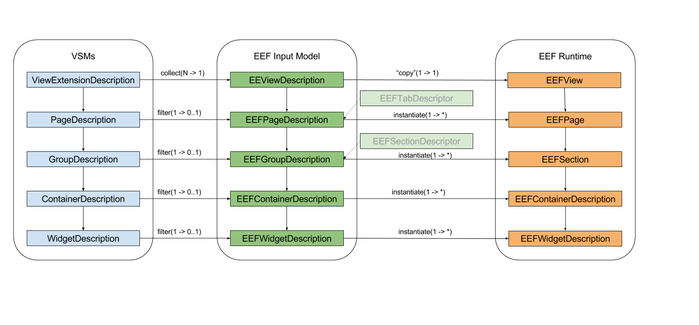

The document specifies the rules by which view descriptions (instance(s) of `properties.ecore`) defined in Sirius VSMs produce concrete properties views for a given input. 

This process takes as primary input the Eclipse selection, given as input to the property view by the workbench via `TabbedPropertySheetPage.selectionChanged(IWorkbenchPart, ISelection)`. From this primary input we first derive secondary input information, in particular the *effective description* to consider to produce the concrete properties view. This effective description will be a list of `PageDescription` instances. These are then transformed into `EEFPageDescription` (wrapped in an `EEFViewDescription`)

<!-- Source: https://docs.google.com/drawings/d/105gWKtfalSjmrLKqO7iU-RrEAcevQG4N2U1Bjim6s0o/edit?usp=sharing -->


##### Input and Effective Description

Our contribution to the `org.eclipse.ui.views.properties.tabbed.propertyContributor` extension point is (currently) only enabled for Sirius editors (diagrams, tables and trees), so in our case the selection (primary input) will always be a Sirius-owned element (`DRepresentation`, `DSemanticDecorator` or `GraphicalEditPart` which represents a `DRepresentation` or `DSemanticDecorator`) or a semantic `EObject` which is part of a Sirius session. 

From this we define the following values:

* `semanticElement`: the underlying, business-level `EObject` selected by the user. This can not be null;
* `view`: the `DRepresentation` or `DSemanticDecorator` through which the user selected the `semanticElement`. This may be null if the element was directly selected (for example from the _Model Explorer_ view when we support this);
* `representation`: the `DRepresentation` which contains the `view`. This may be null if the `view` itself is null. It may be the same value as `view` if the user selected the representation itself (i.e. the background of a diagram).
* `session`: the Sirius session which `semanticElement` is part of. This can not be null.

Given the session, the set of `PageDescription` which will serve as the effective description of the contributes tabs/pages is (currently) defined as the result of this AQL expression:

```
session.selectedViewpoints
       .eContainer(description::Group)
       .eContents(properties::ViewExtensionDescription)
       .pages
```

In other words, we select the `PageDescription` from all the `ViewExtensionDescription` defined in a VSM from which at least one `Viewpoint` is currently enabled. This is very coarse-grained, and will be refined later to take detailed context information (e.g. the `view` and `representation`) into account, but this will require changes in the `properties.ecore` metamodel.

If the expression above produces an empty set of `PageDescription`, a default model (`default.properties`) with generic rules is taken as effective description instead, and the rest of the conversion proceeds normally using that default description.

_Note:_ The order in which groups of `PageDescription` from different VSMs are returned is undefined, as their is no inherent/meaningful ordering in the viewpoints selected in a session. We'll need to introduce separate mechanisms to allow specifiers to control the pages/tabs orderings at a later point. For now, something like alphabetical ordering of the final tabs should be enough.

##### Transformation

Given the primary input and the set of `PageDescription` to consider, the next step is to produce a corresponding instance of `EEFViewDescription` that can be handed to the EEF2 runtime.

This is done in two phases:

1. the first one is handled inside `SiriusTabDescriptorProvider.getTabDescriptors(IWorkbenchPart, ISelection)`: the PVF (Properties View Framework) expects a known/fixed set of tabs and sections descriptors as a result. This means the dynamic parts of which pages and sections to concretely instanciate from the description model must be handled at this level (from inside Sirius). For example if the `semanticElement` is an instance of `uml.Class` and one of the pages description in the effective description indicates (through its `domainClass`) that it only concerns instances of `uml.Property`, we should not produce an `ITabDescriptor` for that page. On the other hand, a single `PageDescription` from inside a VSM may produce multiple tabs.
2. the concrete widgets that must appear inside a particular section will only be instanciated on demand from the tabbed properties framework (e.g. when the user actually selects a specific page, see `TabContents.createControls(Composite, TabbedPropertySheetPage)` called from `TabbedPropertySheetPage.setInput(IWorkbenchPart, ISelection)`). The creation of the actual containers and widgets is thus deferred to the EEF runtime, which must have enough information passed to its `EEFPageDescription` to do it.

This leads to the following split of responsibility:

* Inside `SiriusTabDescriptorProvider.getTabDescriptors()`, we evaluate the dynamic properties of the `PageDescriptions` and `GroupDescriptions` according to the current input, to produce as many (or as few) `EEFPage(Description)` and `EEFGroup(Description)` as required to produce the `ITabDescriptors` and `ISectionDescriptors` needed early by the PVF. This means the `EEFPage(Description)` and `EEFGroup(Description)` do not need the dynamic properties they have currently (`labelExpression` and `semanticCandidateExpression`).
* Only inside `EEFSection` methods like `setInput()`, `refresh()` do we instantiate concrete widgets from `EEFContainerDescription` and `EEFWidgetDescriptions`. This means the `EEFSection` produced in the first phase on the Sirius side must pass along all the dynamic information needed (all expressions and domain classes) uninterpreted to the `EEFContainerDescription` and `EEFWidgetDescriptions` inside the `EEFGroupDescriptions` it produced.

